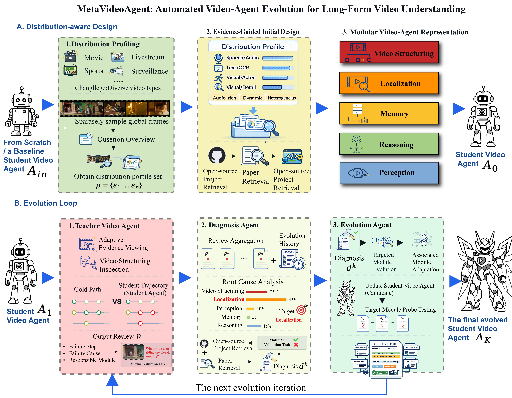

<div align="center">

# MetaVideoAgent

### Automated Video-Agent Evolution for Long-Form Video Understanding

Build a distribution-aware video agent from scratch, then improve it through
execution evidence and a fully automatic Codex evolution loop.

[Overview](#overview) · [Quick start](#quick-start) · [Automatic evolution](#primary-interface-codex-automatic) · [VA-EvoBench](#included-benchmark-va-evobench) · [Held-out reporting](#read-only-held-out-reporting) · [Paper](#paper)

</div>

## Overview

MetaVideoAgent builds a five-module agent from observations of a target video
distribution and evolves it from execution trajectories. This release contains
one from-scratch initialization route. Its primary public interface is the
Codex automatic workflow, which orchestrates initial authoring, validation, and
multiple review, diagnosis, research, evolution, and evaluation rounds.

<p align="center">
  
</p>

<p align="center"><em>Distribution-Aware Design initializes the Student Video Agent for a target video distribution. In each iteration, the Teacher Video Agent reviews failures, the Diagnosis Agent identifies recurring causes and responsible modules, and the Evolution Agent implements targeted code-level updates. A validated candidate becomes the Student for the next iteration.</em></p>

### Highlights

| Capability | Public release behavior |
| --- | --- |
| Distribution-aware initialization | Profiles the training-video distribution and authors one complete five-module agent from scratch. |
| Automatic evolution | Uses Codex for initial authoring and bounded multi-round repair, with explicit smoke, probe, and full-evaluation gates. |
| Adaptive module scope | Evolves one module for a local failure, multiple modules for a coupled failure, and expands the changed set only when probe evidence supports the dependency. |
| Current-best selection | Selects candidates using the evolution split and retains the accepted current-best bundle as the next round's base. |
| Provider-independent runtime | Uses declarative capability profiles while preserving the paper-reproduction configuration as the shipped default. |
| Reproducible benchmark release | Includes VA-EvoBench as a standalone source-repository artifact without coupling it to the MetaVideoAgent runtime. |

No existing-agent initialization variants, benchmark-specific launchers,
model weights, media, or generated outputs are included. The repository also
publishes the standalone VA-EvoBench annotation package described below; it is
not part of the MetaVideoAgent runtime input path.

## Repository layout

```text
assets/                   README and repository media
configs/                  distribution and provider examples
VA-EvoBench/              standalone benchmark released with this repository
evolution/                profiling, review, diagnosis, authoring and evaluation
execution/                five-module runtime and workflow orchestration
scripts/run_automatic.py  primary multi-round Codex interface
scripts/run_held_out.py   read-only evaluation of a frozen agent
examples/                 input examples
requirements/             bounded core and development dependencies
```

## Included benchmark: VA-EvoBench

[`VA-EvoBench/`](VA-EvoBench/) contains the benchmark annotations, fixed
evolution/held-out membership, validation utility, evaluator, dataset card, and
upstream-rights notice used for the accompanying evaluation. It contains no
video files. Obtain source media separately through the official CG-Bench
release and comply with its access conditions.

The benchmark is colocated for source-repository publication only and is not
included in the Python wheel. MetaVideoAgent does not import, install, discover,
or execute VA-EvoBench automatically, and its public runtime interfaces remain
dataset-agnostic. See [`VA-EvoBench/README.md`](VA-EvoBench/README.md) for its
independent data and annotation-access protocol.

## Quick start

### 1. Install MetaVideoAgent

Python 3.10 or newer is required.

```bash
python -m pip install -e .
```

The default installation uses bounded dependency ranges. For the maintained
direct-dependency reproduction baseline, install the pinned set first:

```bash
python -m pip install -r requirements/reproduction.txt
python -m pip install -e . --no-deps
```

Codex automatic authoring also requires an authenticated `codex` executable on
`PATH`, or an explicit `--codex-cli` path. Internally, that executable is
resolved through a single command adapter. Advanced deployments may point
`--codex-cli` to a wrapper that implements the same Codex `exec` command
contract; this replaces the implementation behind the automatic workflow and
does not create another public route.

For development and release-contract checks, install the development dependency
group and run the test suite:

```bash
python -m pip install -e '.[dev]'
python -m pytest
```

### 2. Configure model providers

Runtime models are selected through the declarative capability profile file at
`evolution/agent_docs/capabilities/runtime_capability_profiles.json`. The file
shipped with the repository records the paper-reproduction configuration. It is
a default, not a provider lock.

To use another provider, start from
`configs/provider_profiles.openai_compatible.example.json`, fill in model IDs,
and then set:

```bash
export METAVIDEOAGENT_CAPABILITY_PROFILES=configs/provider_profiles.openai_compatible.example.json
export METAVIDEOAGENT_API_KEY=...
export METAVIDEOAGENT_BASE_URL=https://provider.example/v1
export METAVIDEOAGENT_LLM_PROFILE=custom.llm.reasoning
export METAVIDEOAGENT_EVOLUTION_LLM_PROFILE=custom.llm.evolution
export METAVIDEOAGENT_REVIEW_LLM_PROFILE=custom.llm.evolution
export METAVIDEOAGENT_POST_DECISION_LLM_PROFILE=custom.llm.evolution
export METAVIDEOAGENT_VLM_PROFILE=custom.vlm.default
export METAVIDEOAGENT_ASR_PROFILE=custom.asr.default
export METAVIDEOAGENT_OCR_PROFILE=custom.ocr.default
export METAVIDEOAGENT_EMBEDDING_PROFILE=custom.embedding.default
```

`.env.example` is a shell-variable template and is not loaded automatically.
Copy or source only the values appropriate for your environment; never commit a
populated credential file.

`METAVIDEOAGENT_LLM_PROFILE` selects the execution agent's reasoning model.
The evolution, review, and post-decision variables select the DiagnosisAgent,
Teacher, and post-evaluation decision models, respectively; they may all point
to one profile. Prefer environment variables for credentials because
command-line arguments may be visible to local process inspection tools. The
CLI retains `--api-key` and `--base-url` only for controlled invocation
environments; their values are redacted from the run journal.

### 3. Prepare the data contract

Create a workspace containing raw videos and JSONL split files:

```text
workspace/
  raw_videos/
    <video_id>.mp4
data/
  train.jsonl
  test.jsonl
```

Each evolution JSONL record must contain `video_id`, `question`, `options` or
`choices`, an answer field such as `gt_answer`, and one or more positive
annotated intervals in `time_reference`. The canonical representation is a
list of `[start_sec, end_sec]` pairs, for example `[[0.0, 30.0]]`; one flat pair
is also accepted as a single interval. `options` is normalized to the canonical
runtime field `choices`. Manifest-relative paths are resolved relative to the
manifest file; see `configs/distribution_manifest.example.json`.

Held-out records require the same video/question/options/answer fields. They do
not require evidence intervals because held-out execution is reporting-only and
never invokes Teacher review.

The training split is the evolution and candidate-selection split. The test
split is held out and is never used to update the current-best agent.

## Primary interface: Codex automatic

The following command builds one five-frame, query-aware record per evolution
video, authors and evaluates the initial agent, and uses the paper's four-update
budget by default:

```bash
python scripts/run_automatic.py \
  --distribution-manifest configs/distribution_manifest.example.json \
  --workspace workspace \
  --run-id example_run \
  --output-root artifacts \
  --auto-rounds 4 \
  --run \
  --base-url "$METAVIDEOAGENT_BASE_URL"
```

Use `--check-only` instead of `--run` to validate the configuration and planned
artifact paths without model calls.

The shipped Codex model and reasoning effort are operational defaults, not
model settings specified by the paper and not locks. Override them with
`--codex-model` and `--codex-reasoning-effort` when your Codex installation
supports the selection.

The final report contains `automatic_final_current_best`, including the frozen
bundle, evolution-split report, results, and reference label. The public entry
point defaults to four update rounds; `--auto-rounds` makes the requested update
budget explicit for another evaluation protocol.

Each later round records a non-empty `target_modules` set. A module-local
failure may select and change one module; an interface-coupled failure may
select multiple modules, and probe evidence may justify adding another related
module during bounded repair. All cases use the same Codex automatic workflow
and the same self-contained five-module candidate-bundle contract. Unchanged
modules are retained exactly from the accepted current-best bundle.

## Operational notes

MetaVideoAgent's public workflow is fully automatic and uses Codex for initial
authoring and evolution. A less capable coding-agent implementation may require
an implementation review when a validation gate fails, when repeated probes
remain inconclusive, or when technically valid rounds produce weaker-than-
expected gains on the evolution split. Typical areas to inspect include:

- producing all five modules with the exact runtime ABI and bundle schema;
- preserving structured evidence across structuring, localization, perception,
  memory, and thinking handoffs;
- repairing import, syntax, schema, or runtime-smoke failures without adding
  task-specific rules;
- translating diagnosis and review evidence into a self-contained replacement
  bundle while preserving unaffected behavior; and
- interpreting complete probe trajectories when the first bounded repair does
  not resolve the failure.

If a generated implementation is corrected, record the changed artifact and
rerun the same smoke and probe gates. Such troubleshooting does not define a
separate evolution route and must not use held-out labels, benchmark-specific
answers, video identifiers, or fixed timestamps. The repository does not ship
a separate intervention interface.

Codex authoring and research run with workspace-write sandboxing in isolated
staging or run-artifact directories. MetaVideoAgent provider credentials and
base URLs are removed from the coding-agent subprocess environment. Generated
bundle code subsequently executes in the local Python runtime, which is not an
operating-system security boundary for untrusted code. Review generated source
and run MetaVideoAgent only in an environment whose runtime files and
credentials may safely be exposed to that code.

## Read-only held-out reporting

After evolution, freeze the bundle named by `automatic_final_current_best` and
evaluate it on the manifest's test split. The paired train report proves that
the exact bundle completed evolution-split evaluation; held-out results are
written under `<candidate-run>/held_out_evaluation` and never update the
current-best ledger.

```bash
python scripts/run_held_out.py \
  --distribution-manifest configs/distribution_manifest.example.json \
  --workspace workspace \
  --candidate-run artifacts/frozen_candidate_run \
  --candidate-bundle artifacts/frozen_current_best_bundle.json \
  --train-diagnostic-report artifacts/frozen_train_full_eval_report.json
```

Use `--check-only` to validate the frozen-bundle, train-report, test-data, and
media contracts without executing models.

## Paper

**MetaVideoAgent: Automated Video-Agent Evolution for Long-Form Video
Understanding**  
Benlei Cui, Ruize Wang, Junjie Li, Jinhao Chen, Longtao Huang, Yinghao Chen,
Yuwen Zhai, Jingqun Tang, Ruijian Jia, Weiwei Wu, Pengfei Sun, and Haiwen Hong.  
[arXiv:2608.04587](https://arxiv.org/abs/2608.04587), 2026.

Project repository: [Alibaba-VELLDEPTH/MetaVideoAgent](https://github.com/Alibaba-VELLDEPTH/MetaVideoAgent)

```bibtex
@article{cui2026metavideoagent,
  title         = {MetaVideoAgent: Automated Video-Agent Evolution for Long-Form Video Understanding},
  author        = {Cui, Benlei and Wang, Ruize and Li, Junjie and Chen, Jinhao and Huang, Longtao and Chen, Yinghao and Zhai, Yuwen and Tang, Jingqun and Jia, Ruijian and Wu, Weiwei and Sun, Pengfei and Hong, Haiwen},
  journal       = {arXiv preprint arXiv:2608.04587},
  year          = {2026},
  eprint        = {2608.04587},
  archivePrefix = {arXiv},
  primaryClass  = {cs.CV},
  doi           = {10.48550/arXiv.2608.04587}
}
```

## License and third parties

MetaVideoAgent is released under the Apache License 2.0. See `LICENSE` and
`THIRD_PARTY_NOTICES.md`; both are included in source distributions and wheel
license metadata. Third-party libraries, models, media, and services are
not bundled and remain subject to their own terms. The selected CG-Bench
annotation fields distributed in `VA-EvoBench/` remain subject to the upstream
terms documented in `VA-EvoBench/NOTICE.md`.
